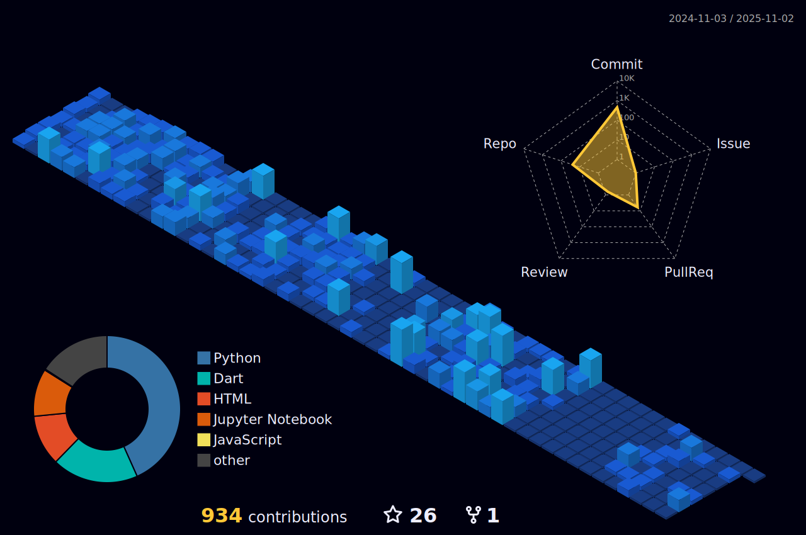

  
<h1 align="center">
  Hi
  
</h1>

<h6>I code for fun.</h6></h6>

<!--# 💻 Tech Stack:

	<code></code>
	<code></code>
	<code></code>
	<code></code>
	<code></code>
	<code></code>
 	<code></code>
	<code></code>
	<code></code>

	<code></code>
	<code></code>
	<code></code>
	<code></code>
	<code></code>

  	<code></code>
  	<code></code>
  	<code></code>  
  	<code></code>  
  	<code></code>  

-->	
# Contribution Graph:

# 📊 GitHub Stats:
 

<!-- Proudly created with GPRM ( https://gprm.itsvg.in ) -->

 <!-- 
 <!--  ### 🔝 Top Contributed Repo
-->

